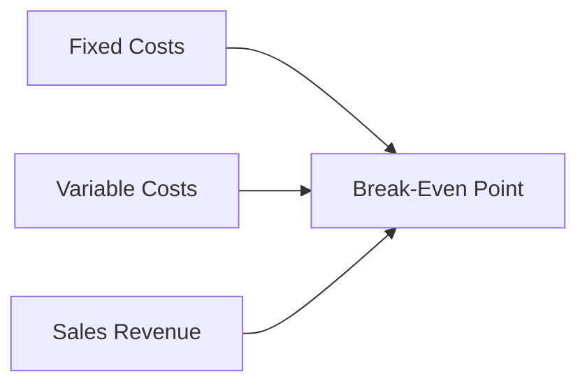
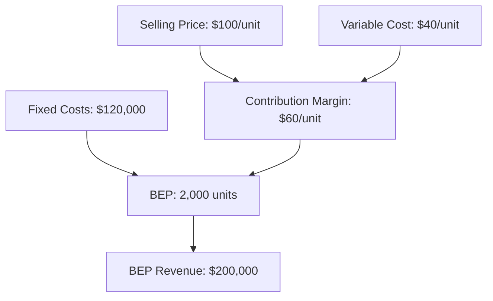
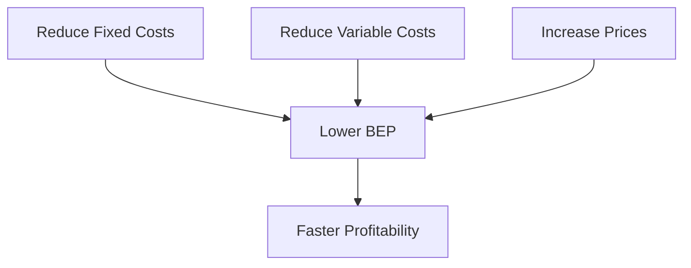
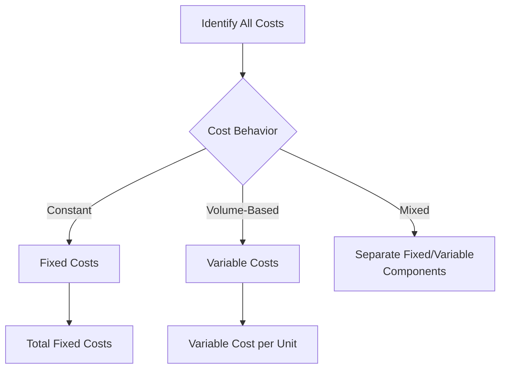

# Break-Even Point (BEP) Analysis: Comprehensive Guide

## Executive Summary
**Break-Even Analysis** is a fundamental financial modeling tool that determines the point at which total revenue equals total costs. This critical business metric helps organizations understand their cost structure, pricing strategy, and operational scalability.

## Fundamental Concepts

### Core Definition
The **Break-Even Point (BEP)** is the production level or sales volume at which total revenues equal total expenses, resulting in zero net profit or loss.

## Key Terminology

| Term | Definition | Formula | Example |
|------|------------|---------|---------|
| **Fixed Costs (FC)** | Costs that remain constant regardless of production volume | - | Rent, salaries, insurance |
| **Variable Costs (VC)** | Costs that vary directly with production volume | - | Raw materials, commissions |
| **Contribution Margin (CM)** | Revenue remaining after variable costs per unit | CM = P - VC | $100 - $40 = $60 |
| **BEP in Units** | Units needed to sell to break even | FC / CM | $120,000 / $60 = 2,000 units |
| **BEP in Revenue** | Revenue needed to break even | BEP Units × P | 2,000 × $100 = $200,000 |

## Mathematical Framework

## Core Formulas

### 1. Basic BEP Calculation

BEP (units) = Fixed Costs ÷ (Selling Price per Unit - Variable Cost per Unit)
           = FC ÷ (P - VC)

### 2. Contribution Margin Approach

Contribution Margin = Selling Price - Variable Cost per Unit
BEP (units) = Total Fixed Costs ÷ Contribution Margin per Unit

### 3. Revenue-Based BEP

BEP (revenue) = Fixed Costs ÷ Contribution Margin Ratio
Contribution Margin Ratio = (Sales - Variable Costs) ÷ Sales

## Practical Example: Manufacturing Company

Given:

 - Fixed Costs: $120,000 annually
 - Selling Price: $100 per unit
 - Variable Cost: $40 per unit

Calculations:

## Advanced BEP Applications

## Multi-Product BEP Analysis
For companies with multiple products, use weighted average contribution margin:

Weighted Average CM = Σ(CM per product × Sales Mix Percentage)
BEP (units) = Total FC ÷ Weighted Average CM

## Service Industry BEP

Example: Consulting Firm

 - Fixed Costs: $300,000 (salaries, office, utilities)
 - Hourly Rate: $200
 - Variable Cost: $50 per hour (materials, commissions)
 - BEP Hours = $300,000 ÷ ($200 - $50) = 2,000 hours

## E-commerce BEP Model

### Components:

 - Fixed: Platform fees, salaries, marketing retainers
 - Variable: Payment processing, shipping, packaging, COGS
 - BEP Orders = Fixed Costs ÷ (Average Order Value - Variable Cost per Order)

## Strategic Implications

### 1. Pricing Strategy

Sensitivity Analysis: How price changes affect BEP

 - 10% Price Increase: BEP decreases by ~9%
 - 10% Price Decrease: BEP increases by ~11%

### 2. Cost Structure Optimization

### 3. Operational Decisions

 - Capacity Planning: Minimum production requirements
 - Investment Justification: Equipment purchases affecting fixed/variable costs
 - Expansion Analysis: Impact of new locations or product lines

## Margin of Safety Analysis

### Definition
**Margin of Safety** = (Current Sales - Break-Even Sales) ÷ Current Sales

### Interpretation

| Margin of Safety | Risk Level | Strategic Implication |
|------------------|------------|----------------------|
| >30% | Low | Aggressive growth, investment |
| 15-30% | Moderate | Controlled expansion |
| 5-15% | High | Cost control focus |
| <5% | Critical | Immediate restructuring needed |

## Industry-Specific Considerations

## Manufacturing

 - High Fixed Costs: Significant initial BEP hurdle
 - Economies of Scale: BEP decreases with volume
 - Inventory Impact: Carrying costs affect overall profitability

## Software/SaaS

 - High Initial Development: Substantial fixed costs
 - Low Variable Costs: Rapid scalability post-BEP
 - Customer Lifetime Value: Critical for accurate BEP calculation

## Retail

 - Inventory Turnover: Key variable cost driver
 - Seasonal Variations: Multiple BEP points throughout year
 - Foot Traffic Analysis: Fixed cost allocation per location

## Limitations and Assumptions

## Key Limitations

1. Linear Assumption: Assumes costs and revenues are linear
2. Constant Mix: Assumes consistent product/service mix
3. Price Stability: Ignores volume discounts and price elasticity
4. Time Value: Doesn't account for time value of money
5. Quality Impact: Ignores quality-cost relationships

## Mitigation Strategies

 - Use sensitivity analysis for key variables
 - Calculate multiple scenarios (best case/worst case)
 - Update regularly with actual performance data
 - Combine with cash flow analysis

## Implementation Framework

### Step 1: Cost Classification

### Step 2: Data Collection

 - Historical cost data (12-24 months)
 - Sales volume and pricing information
 - Product mix analysis
 - Market demand projections

### Step 3: Analysis and Modeling

 - Calculate current BEP
 - Perform sensitivity analysis
 - Develop multiple scenarios
 - Create visual dashboards

### Step 4: Strategic Application

 - Set sales targets
 - Evaluate pricing strategies
 - Assess cost reduction opportunities
 - Support investment decisions

## Technology Integration
## Modern Tools for BEP Analysis
 - Excel/Sheets: Basic modeling and sensitivity analysis
 - BI Tools: Power BI, Tableau for visualization
 - ERP Systems: Integrated cost accounting
 - Specialized Software: Adaptive Insights, Anaplan

## Automation Opportunities

 - Real-time BEP monitoring
 - Automated cost classification
 - Dynamic scenario modeling
 - Integration with sales forecasting

## Best Practices

## ✅ Recommended Approaches

 - Regular updates (monthly/quarterly)
 - Department-level BEP analysis
 - Product-level profitability
 - Cross-functional review
 - Benchmarking against industry

## ❌ Common Pitfalls to Avoid

 - Oversimplifying cost structures
 - Ignoring opportunity costs
 - Static analysis in dynamic markets
 - Excluding quality and service impacts
 - Forgetting about working capital requirements

## Case Study: Coffee Shop BEP Analysis

### Assumptions:

 - Monthly Fixed Costs: $12,000
 - Average Sale: $5.00
 - Variable Cost per Sale: $1.50
 - Contribution Margin: $3.50

### Calculation:

BEP (cups) = $12,000 ÷ $3.50 = 3,429 cups monthly
BEP (revenue) = 3,429 × $5 = $17,145 monthly

### Strategic Insights:

 - Need ~114 customers daily (30-day month)
 - 20% price increase reduces BEP to 2,857 cups
 - 10% cost reduction lowers BEP to 3,158 cups

## Conclusion
Break-Even Analysis remains an essential tool for:

 - Financial planning and risk assessment
 - Operational decision-making
 - Strategic pricing and cost management
 - Performance monitoring and target setting

When used appropriately with understanding of its limitations, BEP analysis provides critical insights for sustainable business growth and profitability.

Based on research from: Financial Management Association, Harvard Business School, and management accounting literature
