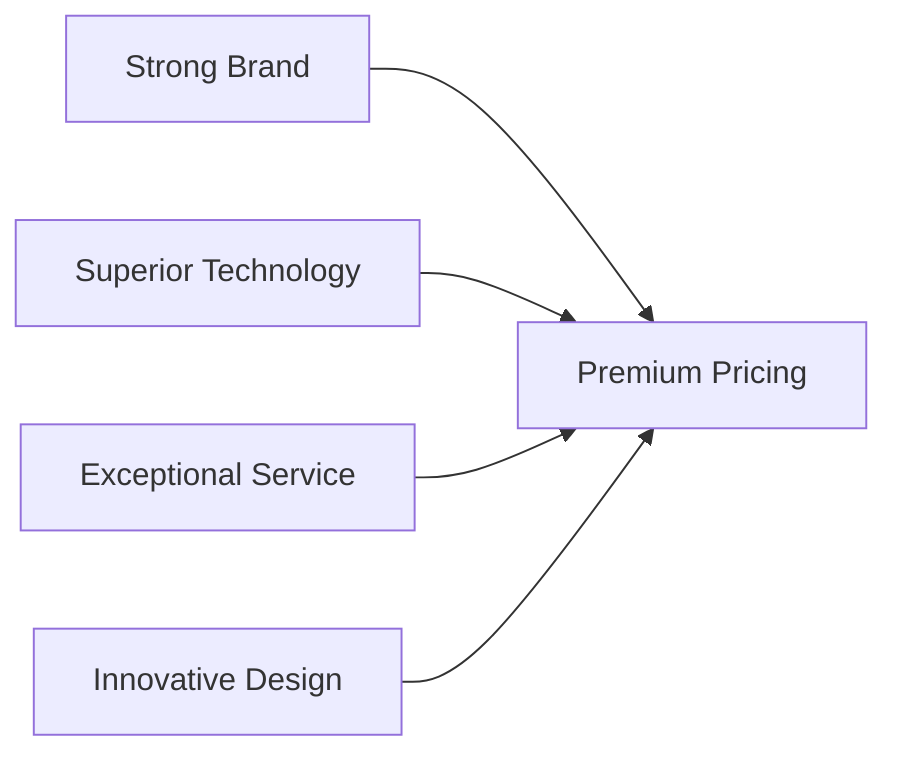
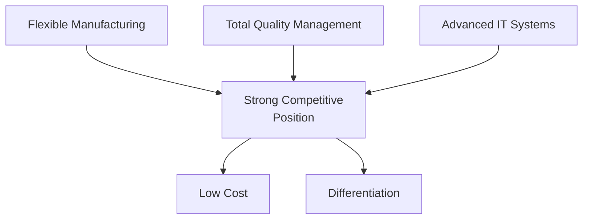

# Business-Level Strategy (BLS): A Complete Guide

A Business-Level Strategy (BLS) defines how a firm competes and gains a competitive advantage in a specific market or industry. It is the core of strategic management, answering the fundamental question: **"How do we win in this market?"**

## 📊 What is a Business-Level Strategy?

A Business-Level Strategy is a cohesive set of commitments and actions a firm uses to gain a competitive advantage by exploiting its core competencies in a specific product market. It is the link between the firm's broader goals (corporate strategy) and the on-the-ground actions (functional strategies).

## 🎯 The 4+1 Types of Business-Level Strategies

Based on Michael Porter's classic typology, there are four primary strategies, determined by the **competitive scope** (broad or narrow market) and **source of competitive advantage** (low cost or uniqueness).

### Porter's Generic Strategies Matrix

```mermaid
graph TD
    subgraph Competitive Advantage
        direction TB
        A1[Low Cost]
        A2[Differentiation]
    end
    
    subgraph Competitive Scope
        direction LR
        B1[Narrow Market]
        B2[Broad Market]
    end
    
    C[Cost Focus<br/>Niche Low-Cost Provider]
    D[Differentiation Focus<br/>Niche Premium Provider]
    E[Cost Leadership<br/>Industry-Wide Low Cost]
    F[Differentiation<br/>Industry-Wide Unique Value]
    
    B1 --> C
    B1 --> D
    B2 --> E
    B2 --> F
    A1 --> C
    A1 --> E
    A2 --> D
    A2 --> F
   
   ```

### 1. 💰 Cost Leadership Strategy
Aim to become the lowest-cost producer in the industry.

🎯 Goal: Attract price-sensitive customers by offering acceptable quality at the lowest price.

🛠️ How it's achieved:

```mermaid
graph LR
    A[Economies of Scale] --> D[Low Cost Position]
    B[Efficient Operations] --> D
    C[Tight Cost Control] --> D
    E[Technology Advantage] --> D
```
🏢 Example: Walmart uses its massive purchasing power and efficient logistics to offer "Everyday Low Prices."

### 2. 🌟 Differentiation Strategy
Aim to create a unique product or service that is valued by customers.

🎯 Goal: Command a premium price by making your offering distinct and desirable for reasons beyond price.

🛠️ How it's achieved:


🏢 Example: Apple differentiates its products through sleek design, a seamless ecosystem, and a powerful brand.

### 3. 🎯 Cost Focus Strategy
Aim to be the lowest-cost producer within a specific market segment (niche).

🎯 Goal: Serve the unique needs of a narrow, targeted buyer group at a lower cost than broader competitors.

🛠️ How it's achieved: Similar to cost leadership, but all efforts are tailored to a specific niche.

🏢 Example: A regional airline that offers no-frills, low-cost flights only on specific, underserved routes.

### 4. 💎 Differentiation Focus Strategy
Aim to offer unique attributes that meet the specific needs of a market segment.

🎯 Goal: Serve a narrow target market with highly specialized products that command loyalty and a premium price.

🛠️ How it's achieved: Similar to differentiation, but the uniqueness is tailored to a specific group.

🏢 Example: Rolex focuses on the luxury watch segment, differentiating through prestige, craftsmanship, and heritage.

### 🔄 The Fifth "Integrated" Strategy
Modern theory suggests a fifth, hybrid approach is possible with advanced technology and management.

⚡ Integrated Cost Leadership/Differentiation Strategy
Aim to simultaneously achieve low cost and differentiation.


### 🎯 Goal: Provide unique value (differentiation) while maintaining low costs, creating an extremely strong competitive position.

🏢 Example: Toyota is often cited for its ability to produce high-quality, reliable cars (differentiation) at competitive prices (cost leadership) through its renowned Toyota Production System.

## 🔍 Choosing the Right Business-Level Strategy
Selecting a BLS is not arbitrary. It requires a deep understanding of your:

### 1. External Analysis
🔍 Tools: PESTEL Analysis, Porter's Five Forces<br>
❓ Questions: Who are your competitors? What do customers value? What are industry trends?

### 2. Internal Analysis
🔍 Tools: VRIO Framework, Value Chain Analysis<br>
❓ Questions: What are your core strengths? What can you do better than anyone else?

## ⚠️ Strategic Pitfalls to Avoid

| Pitfall | Description | Warning Signs |
|---------|-------------|---------------|
| **"Stuck in the Middle"** | No clear advantage - not truly low cost or differentiated | Declining market share, price pressure |
| **Imitability** | Competitors can easily copy your advantage | Rapid competitor replication, patent expiration |
| **Market Erosion** | Niche market differences disappear | Segment becomes mainstream, changing customer preferences |

## 📋 Summary Table

| Strategy | Competitive Advantage | Competitive Scope | Risk Level | Key Example |
| :--- | :--- | :--- | :--- | :--- |
| **Cost Leadership** | Low Cost | Broad Market | 🟡 Medium | Walmart |
| **Differentiation** | Uniqueness | Broad Market | 🟡 Medium | Apple |
| **Cost Focus** | Low Cost | Narrow Segment | 🟢 Low | Regional Airline |
| **Differentiation Focus** | Uniqueness | Narrow Segment | 🟢 Low | Rolex |
| **Integrated** | Low Cost & Uniqueness | Broad Market | 🔴 High | Toyota |

## 🚀 Next Steps

  1. Conduct internal and external analysis using the frameworks mentioned
  2. Evaluate your core competencies against market opportunities
  3. Choose one primary strategy to avoid being "stuck in the middle"
  4. Align organizational resources to support your chosen strategy
  5. Continuously monitor for strategic drift and competitive threats
